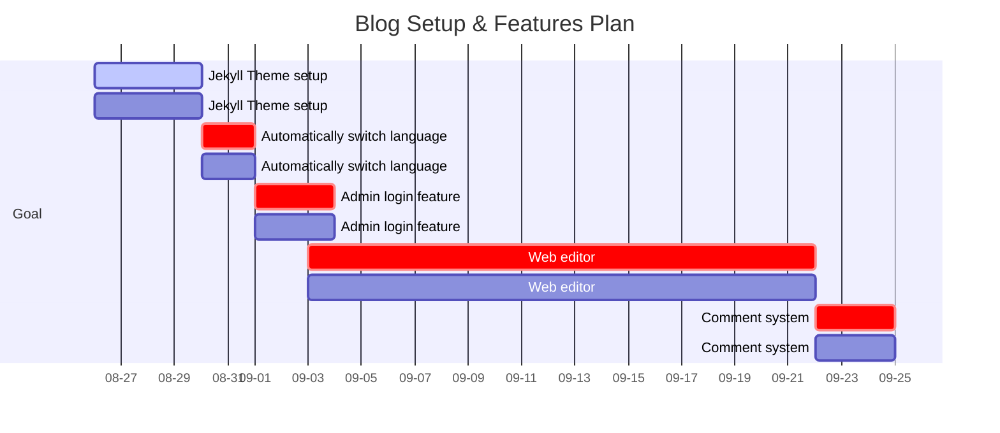

# About This Blog

## Language & Third-party
This blog is based on the **Chirpy Jekyll Theme (v7.3.1)** and uses the following technologies:

- **Languages:** HTML, CSS, JavaScript, Liquid, Markdown
- **Libraries & Plugins:** Prism.js (code highlighting), FontAwesome (icons), any other custom scripts or styles

## Goals
- Use Jekyll theme
- Automatically switch language according to the user's browser settings
- If you edit webpage or create a post, need to login (GitHub)
- Make a personal web-editor
- Posts created with the web editor must be saved as Markdown files and automatically committed and pushed to the repository
- Credentials data must be encrypted
- Enable user comments by managing comment data through Google Sheets

## Goal Plan Gantt Chart

## Planned Posts
- Planned posts will cover a broad range of IT topics, from embedded systems to web development and databases.  
- The main focus will be on MES.  
- Posts will also include content related to Traditional Chinese (Mandarin).

## Contact
- Email: leeio3@naver.com